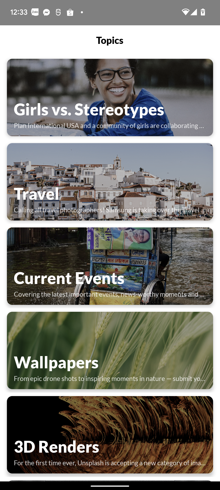
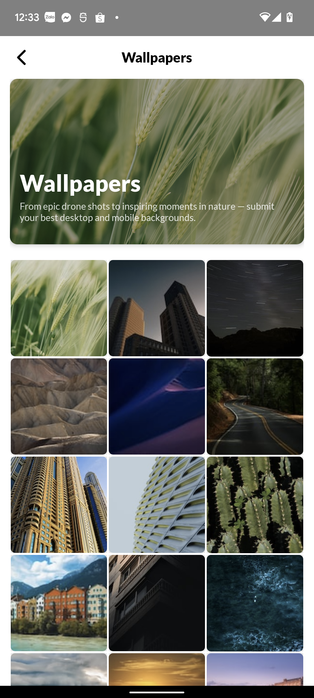
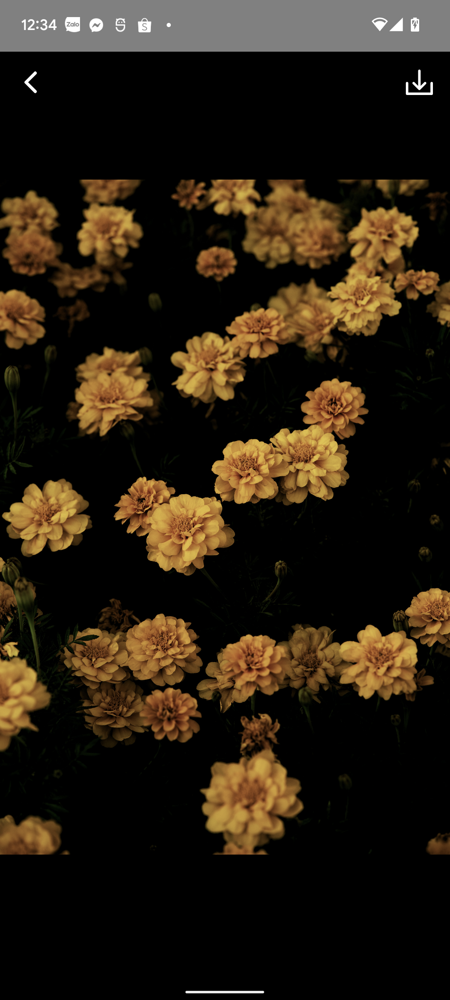

# Base Clean Architecture starter project

## Sample photo application built using clean architecture model

## Architecture:
- Built with Modern Android Development practices
- Utilized Usecase, Repository pattern for data
- Includes unit tests for Use cases, Repository, ViewModels, API Service response.

## Features
- Get topics list from Unsplash API
- Get the photos in each topic
- View, Download photos

## Demo

## Video
<video width="320" height="712" controls>
  <source src="video.mp4" type="video/mp4">
  Your browser does not support the video tag.
</video>

## Build with

- [Kotlin](https://kotlinlang.org/) - First class and official programming language for Android development.
- [Coroutines](https://kotlinlang.org/docs/reference/coroutines-overview.html) - For asynchronous and more..
- [Flow](https://kotlin.github.io/kotlinx.coroutines/kotlinx-coroutines-core/kotlinx.coroutines.flow/-flow/) - A cold asynchronous data stream that sequentially emits values and completes normally or with an exception.
- [Android Architecture Components](https://developer.android.com/topic/libraries/architecture) - Collection of libraries that help you design robust, testable, and maintainable apps.
  - [Paging 3.0](https://developer.android.com/topic/libraries/architecture/paging/v3-overview) -The Paging library helps you load and display pages of data from a larger dataset from local storage or over network.
  - [LiveData](https://developer.android.com/topic/libraries/architecture/livedata) - Data objects that notify views when the underlying database changes.
  - [ViewModel](https://developer.android.com/topic/libraries/architecture/viewmodel) - Stores UI-related data that isn't destroyed on UI changes.
  - [ViewBinding](https://developer.android.com/topic/libraries/view-binding) - Generates a binding class for each XML layout file present in that module and allows you to more easily write code that interacts with views.
  - [DataBinding](https://developer.android.com/topic/libraries/data-binding) - Support library that allows you to bind UI components in your layouts to data sources in your app using a declarative format rather than programmatically.
- [Dependency Injection](https://developer.android.com/training/dependency-injection)
  - [Hilt](https://dagger.dev/hilt) - Easier way to incorporate Dagger DI into Android apps.
- [Retrofit](https://square.github.io/retrofit/) - A type-safe HTTP client for Android and Java.
- [Glide](https://github.com/bumptech/glide) - An image loading and caching library for Android focused on smooth scrolling.
- [Gradle Kotlin DSL](https://docs.gradle.org/current/userguide/kotlin_dsl.html) - For writing Gradle build scripts using Kotlin.

